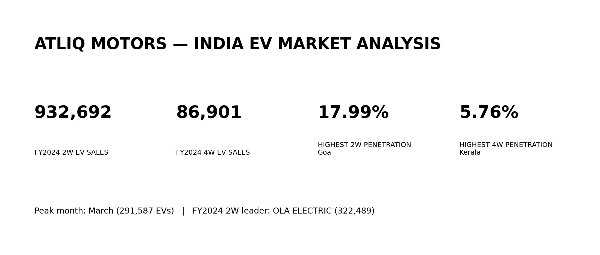
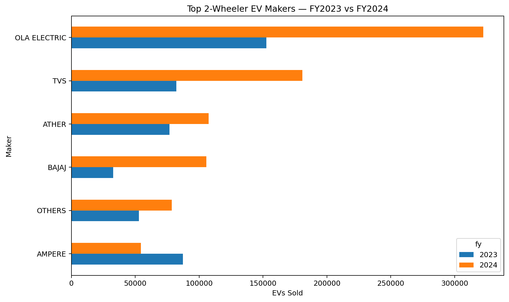
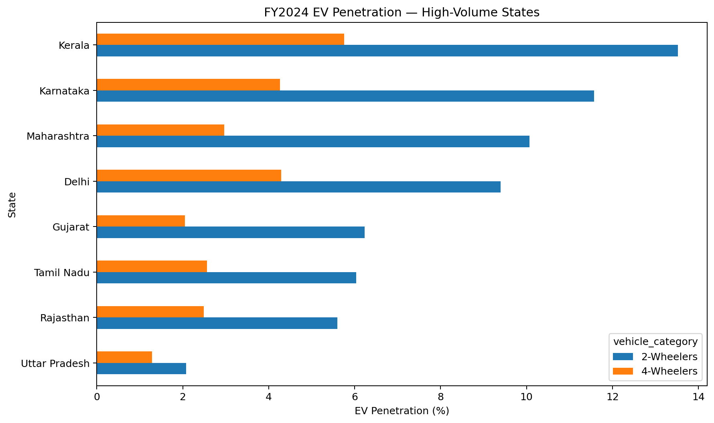
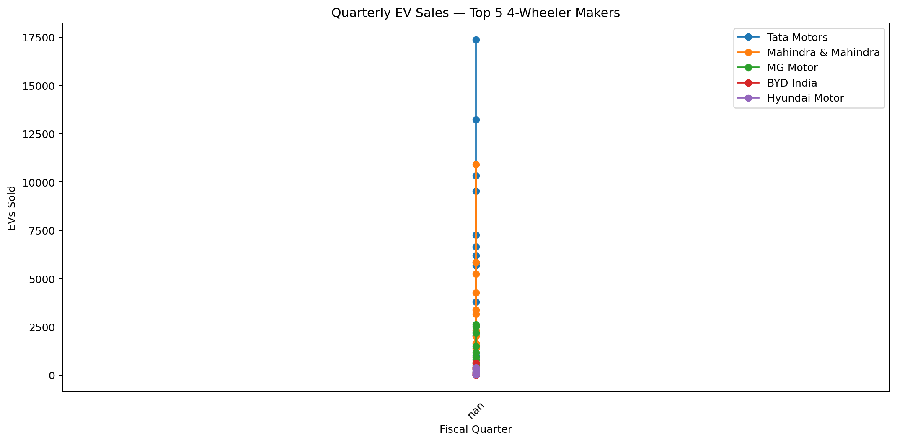
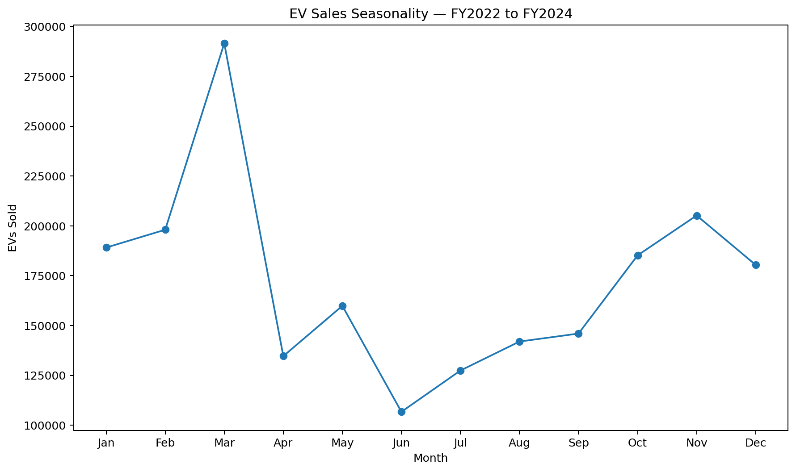
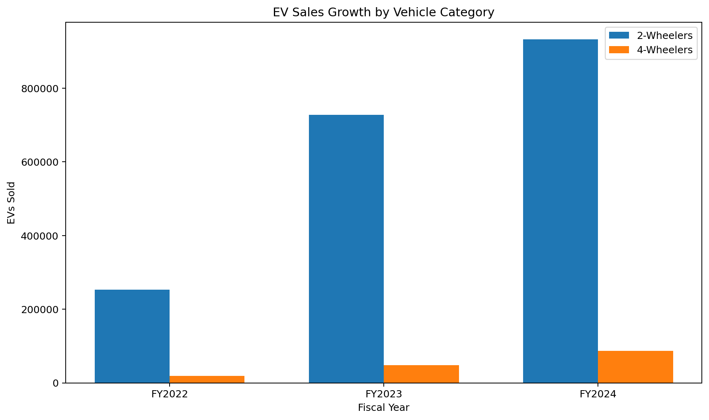

# 🚗 AtliQ Motors — EV Market Analysis



## 📌 Project Overview

AtliQ Motors is an automotive company specializing in electric vehicles (EVs). The company has established a strong position in the electric and hybrid vehicle segment in North America and is evaluating an expansion into the Indian market.

The objective of this project is to analyze India's EV market using historical vehicle registration data and provide data-driven insights that can support AtliQ Motors' market-entry strategy.

The analysis covers **FY2022 to FY2024** and examines EV sales, market penetration, manufacturer performance, state-level growth, seasonality and future growth scenarios.

The original business case asks the analytics team to conduct a detailed Indian EV market study before proceeding with expansion.

---

# 🎯 Business Objectives

The analysis focuses on answering key business questions around:

* EV manufacturer performance
* State-level EV penetration
* EV market growth
* 2-wheeler and 4-wheeler trends
* Quarterly sales trends
* CAGR analysis
* Seasonal demand patterns
* 2030 EV sales scenarios
* Estimated revenue growth

The project also considers strategic questions around customer motivations, government incentives, charging infrastructure and manufacturing location.

---

# 🗂️ Dataset

The project uses three primary datasets:

| Dataset                                | Description                                               |
| -------------------------------------- | --------------------------------------------------------- |
| `dim_date.csv`                         | Date, fiscal year and quarter information                 |
| `electric_vehicle_sales_by_makers.csv` | EV sales by manufacturer and vehicle category             |
| `electric_vehicle_sales_by_state.csv`  | EV sales, total vehicle sales and state-level information |

The dataset is based on publicly available vehicle registration data from **Vahan Sewa**, as referenced in the original project brief.

---

# 🛠️ Tools & Technologies

* **MySQL**
* SQL
* MySQL Workbench
* Excel
* GitHub
* CSV

### SQL Techniques Used

* SELECT
* WHERE
* GROUP BY
* ORDER BY
* JOIN
* Aggregate Functions
* CASE Statements
* Common Table Expressions (CTEs)
* Subqueries
* Window Functions
* ROW_NUMBER()
* RANK()
* LAG()
* CAGR calculations
* Percentage calculations
* Date & time analysis
* Scenario projections

---

# 📊 Key Findings

## 🛵 2-Wheeler Maker Performance



## 🛵 1. 2-Wheeler Manufacturer Performance

### FY2023 — Top 3

| Rank | Manufacturer  |    EV Sales |
| ---: | ------------- | ----------: |
|    1 | OLA ELECTRIC  | **152,583** |
|    2 | OKINAWA       |  **96,945** |
|    3 | HERO ELECTRIC |  **88,993** |

### FY2024 — Top 3

| Rank | Manufacturer |    EV Sales |
| ---: | ------------ | ----------: |
|    1 | OLA ELECTRIC | **322,489** |
|    2 | TVS          | **180,743** |
|    3 | ATHER        | **107,552** |

**Key insight:** OLA ELECTRIC remained the clear market leader in 2-wheelers and more than doubled its sales volume from FY2023 to FY2024.

---




# 📍 2. Top States by EV Penetration — FY2024

## 2-Wheelers

| Rank | State       | Penetration |
| ---: | ----------- | ----------: |
|    1 | Goa         |  **17.99%** |
|    2 | Kerala      |  **13.52%** |
|    3 | Karnataka   |  **11.57%** |
|    4 | Maharashtra |  **10.07%** |
|    5 | Delhi       |   **9.40%** |

## 4-Wheelers

| Rank | State      | Penetration |
| ---: | ---------- | ----------: |
|    1 | Kerala     |   **5.76%** |
|    2 | Chandigarh |   **4.50%** |
|    3 | Delhi      |   **4.29%** |
|    4 | Karnataka  |   **4.26%** |
|    5 | Goa        |   **4.25%** |

**Key insight:** Kerala, Goa, Karnataka and Delhi repeatedly appear among the strongest EV penetration markets.

---

# 📈 3. EV Penetration Growth

When comparing FY2022 with FY2024, the analysis found **no state with a decline in combined EV penetration**.

This indicates that EV penetration increased across all states represented in the dataset during the analysis period.

---




# 🚘 4. Leading 4-Wheeler EV Manufacturers

The top five 4-wheeler EV manufacturers across FY2022–FY2024 were:

1. **Tata Motors**
2. **Mahindra & Mahindra**
3. **MG Motor**
4. **BYD India**
5. **Hyundai Motor**

These manufacturers were used for the quarterly trend analysis.

---

# 🏙️ 5. Delhi vs Karnataka — FY2024

| State     | Vehicle Category | EV Sales | Penetration |
| --------- | ---------------- | -------: | ----------: |
| Delhi     | 2-Wheeler        |   38,094 |   **9.40%** |
| Karnataka | 2-Wheeler        |  148,111 |  **11.57%** |
| Delhi     | 4-Wheeler        |    8,630 |   **4.29%** |
| Karnataka | 4-Wheeler        |   12,878 |   **4.26%** |

**Key insight:** Karnataka has significantly higher 2-wheeler EV volume and penetration. However, Delhi and Karnataka have almost identical 4-wheeler penetration rates.

---

# 🚀 6. 4-Wheeler Manufacturer Growth

Strong growth was observed among major 4-wheeler EV manufacturers between FY2022 and FY2024.

| Manufacturer        | FY2022 | FY2024 |        CAGR |
| ------------------- | -----: | -----: | ----------: |
| BYD India           |     33 |  1,466 | **566.52%** |
| Mahindra & Mahindra |  4,042 | 23,346 | **140.33%** |
| MG Motor            |  1,647 |  8,829 | **131.53%** |
| Tata Motors         | 12,708 | 48,181 |  **94.71%** |

**Note:** CAGR is not calculated where the starting-year sales are zero because the mathematical CAGR formula is undefined.

---

# 🗺️ 7. Fastest-Growing States by Total Vehicle Sales

| Rank | State             | CAGR FY2022–FY2024 |
| ---: | ----------------- | -----------------: |
|    1 | Meghalaya         |         **28.47%** |
|    2 | Goa               |         **27.41%** |
|    3 | Karnataka         |         **25.28%** |
|    4 | Delhi             |         **22.88%** |
|    5 | Rajasthan         |         **21.50%** |
|    6 | Gujarat           |         **20.55%** |
|    7 | Assam             |         **20.13%** |
|    8 | Mizoram           |         **18.77%** |
|    9 | Arunachal Pradesh |         **18.30%** |
|   10 | Haryana           |         **17.68%** |

---




# 📅 8. EV Sales Seasonality

The analysis shows clear variation in EV sales by month.

### 🔥 Peak Month

**March — 291,587 EVs**

### 📉 Lowest Month

**June — 106,709 EVs**

This seasonal pattern can help businesses plan inventory, marketing campaigns and sales resources.

---

# 🔮 9. 2030 EV Sales Scenario

A CAGR-based scenario was calculated for the top 10 FY2024 states by EV penetration.

Examples include:

| State        | FY2024 EV Sales | 2030 Scenario |
| ------------ | --------------: | ------------: |
| Maharashtra  |         197,169 |    **13.35M** |
| Kerala       |          73,938 |    **11.78M** |
| Karnataka    |         160,989 |     **8.38M** |
| Chhattisgarh |          28,540 |     **7.12M** |
| Goa          |          10,799 |     **2.42M** |

### ⚠️ Important Forecasting Limitation

These figures are **mechanical CAGR scenarios**, not realistic demand forecasts.

The projection assumes that the historical FY2022–FY2024 CAGR continues unchanged through 2030. Such an assumption can produce extremely high numbers when the historical growth rate is very high.

Therefore, these figures should be treated as **scenario analysis rather than precise market forecasts**.

---




# 💰 10. EV Sales Growth

## 2-Wheelers

| Fiscal Year | EV Sales |
| ----------- | -------: |
| FY2022      |  252,573 |
| FY2023      |  727,903 |
| FY2024      |  932,692 |

Growth:

* FY2022 → FY2023: **188.20%**
* FY2023 → FY2024: **28.13%**

## 4-Wheelers

| Fiscal Year | EV Sales |
| ----------- | -------: |
| FY2022      |   18,577 |
| FY2023      |   47,465 |
| FY2024      |   86,901 |

Growth:

* FY2022 → FY2023: **155.50%**
* FY2023 → FY2024: **83.08%**

**Key insight:** 4-wheeler EV sales are growing rapidly, although their absolute sales volume remains significantly smaller than the 2-wheeler segment.

---

# 💡 Strategic Recommendations

Based on the analysis, three high-level recommendations for AtliQ Motors are:

### 1. Prioritize High-Penetration Markets

Consider prioritizing markets such as:

* Kerala
* Karnataka
* Goa
* Delhi
* Maharashtra

These states demonstrate strong EV penetration and/or significant EV sales volumes.

### 2. Focus on the Growing 4-Wheeler Opportunity

The 4-wheeler segment increased from **18,577 units in FY2022 to 86,901 units in FY2024**.

This represents a rapidly expanding market opportunity for AtliQ Motors.

### 3. Build a State-Specific Market Entry Strategy

Rather than using a single nationwide strategy, AtliQ should evaluate states based on:

* EV penetration
* EV sales volume
* Total vehicle market size
* Market growth
* Charging infrastructure
* Government incentives
* Manufacturing and operating conditions

The original case specifically asks the analysis team to consider incentives, charging infrastructure, manufacturing location and broader strategic recommendations.

---

# ⚠️ Data & Methodology Notes

### EV Penetration

```text
EV Penetration %
=
EV Sales / Total Vehicle Sales × 100
```

### CAGR

For FY2022–FY2024:

```text
CAGR =
(FY2024 Sales / FY2022 Sales)^(1/2) - 1
```

### 2030 Scenario

```text
2030 Scenario =
FY2024 EV Sales × (1 + CAGR)^6
```

### Revenue

The provided datasets contain **vehicle units rather than vehicle prices**.

Therefore, revenue analysis requires an assumed average vehicle price. Any resulting revenue figure should be treated as an **estimate**, not actual company revenue.

---

# 📁 Project Structure

```text
AtliQ-Motors-EV-Market-Analysis/
│
├── README.md
│
├── data/
│   ├── dim_date.csv
│   ├── electric_vehicle_sales_by_makers.csv
│   └── electric_vehicle_sales_by_state.csv
│
├── sql/
│   └── atliq_motors_ev_analysis.sql
│
└── images/
    └── [analysis visuals]
```

---

# 📌 Skills Demonstrated

This project demonstrates practical skills in:

* SQL
* MySQL
* Data Analysis
* Business Analysis
* EV Market Analysis
* Data Cleaning & Validation
* KPI Analysis
* Market Penetration Analysis
* CAGR Calculation
* Window Functions
* CTEs
* Ranking
* Time-Series Analysis
* Scenario Forecasting
* Business Recommendations

---

# 👨‍💻 About Me

I'm an aspiring **Data Analyst** with hands-on experience in SQL, Power BI, Excel and Python.

I enjoy solving business problems using data and building practical analytics projects that turn raw datasets into actionable insights.

### 🔗 Connect With Me

* LinkedIn: https://www.linkedin.com/in/danish-mahmood-bansberia/
* GitHub: https://github.com/danishmahmood34

---

⭐ Thanks for visiting this project!

